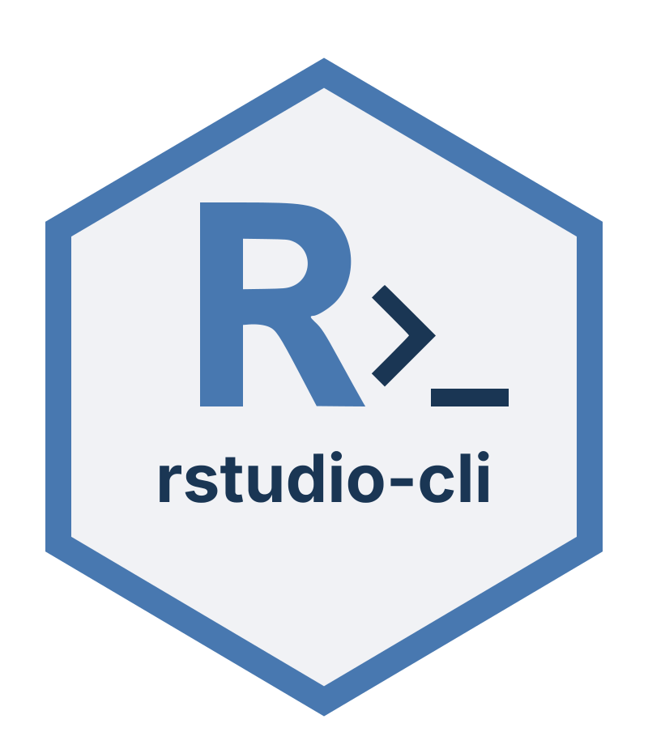

# rstudio-cli

<p align="center"></p>

[](https://github.com/aclemen1/rstudio-cli/actions/workflows/ci.yml)
[](LICENSE)

[AI-native CLI](https://github.com/aclemen1/ai-native-cli) bridge that
lets a terminal-bound process — Claude Code, a shell user, anything
else — drive the live RStudio session running on the same machine:
open files, run R code, list and read terminals, inspect the live R
environment, surface lint-style markers, manage background jobs,
install a Claude Code skill, and more.

The binary is named `rstudio`. It auto-detects which RStudio it's
talking to:

- **RStudio Server** (Linux): the rsession Unix socket. Works from
  inside the embedded terminal *or* any other shell on the same host
  (env vars are auto-discovered via the rsession socket directory).
- **RStudio Desktop** (macOS): the rsession TCP loopback with the
  shared secret, auto-discovered from the running rsession process.

Either way the CLI reuses the active browser/IDE client, so visible
actions land in the user's open tab/window without disrupting it.

## In Claude Code

Claude Code's `/ide` slash command connects the agent to VS Code or
JetBrains (as of this writing — the list may evolve). The agent and
the IDE share state: open files, diagnostics, selection. `/ide` does
not cover RStudio.

Installing the skill (`rstudio skill install`) closes that gap by
adding `/rstudio` as a slash command in Claude Code. Typing
`/rstudio` invokes the skill, which tells the agent how to drive
your live RStudio session — open files, run R, surface markers,
inspect the live environment, manage Jobs — through the CLI, without
disrupting your browser tab.

## Status

**v0.8.2** — covers ~50 of the 117 functions exported by `rstudioapi`,
across 16 categories and 85 actions, with multi-agent safety via
per-session lock + `tx` transaction wrapper. Live-tested end-to-end on both
**RStudio Server** (Linux) and **RStudio Desktop** (macOS).

| category | actions | summary |
|---|---|---|
| `editor` | `open` `edit` `close` `reload` `save` `save-all` `read` `read-buffer` `context` `insert` `select` `list` `new` `active-id` `path` `set-contents` `modify-range` `set-cursor` `set-marks` | Source pane and document operations |
| `r`      | `exec` `send` `poll` | Run R code (silent or visible; async via callr) |
| `console`| `history` `actions` `context` | Console history + buffer + live editor context |
| `term`   | `list` `buffer` `context` `create` `send` `exec` `kill` `clear` `activate` `busy` `running` `exit-code` `visible` `run` | Terminal pane (live shells) |
| `env`    | `list` `contents` `info` | Live R environment inspection |
| `pane`   | `viewer` `files` `markers` `preview-rd` `preview-sql` `save-plot` `highlight-ui` | Non-editor panes |
| `session`| `info` `project` `open-project` `restart` `list` | Whole-session lifecycle |
| `pref`   | `read` `write` `read-rstudio` `write-rstudio` `get-persistent` `set-persistent` | Preferences + persistent values |
| `job`    | `list` `add` `remove` `set-progress` `add-progress` `set-state` `set-status` `add-output` `run-script` `is-active` | Background Jobs pane |
| `ui`     | `dialog` `update-dialog` `prompt` `question` `select-file` `select-dir` `ask-password` `ask-secret` | Modal prompts (BLOCKING) |
| `observe`| `stream` `events` `replay` | Live JSONL stream; event-type catalog; replay a captured stream |
| `policy` | `show` `block` `unblock` | Per-user block list (category or action) |
| `skill`  | `show` `install` | Embedded Claude Code skill |
| `schema` | (drill-down catalog) | Self-describing surface |
| escape   | `rpc` `postback` | Raw JSON-RPC / postback |
| meta     | `version` `status` `tx` | Meta-CLI commands (no rsession schema entry) |

Run `rstudio schema` for the auto-generated catalog of every action.

## Why rstudio-cli?

Several tools let an LLM agent interact with R or RStudio.
Here is an honest, best-effort comparison as of May 2026. If we have
misrepresented what another tool can do, please open an issue and we
will correct it promptly.

> ✓ supported · ~ partial or indirect · ✗ not supported · — not applicable

| Feature | rstudio&#8209;cli | [clauder](https://github.com/imnmv/clauder) | [rstudiomcp](https://github.com/zygi/rstudiomcp) | [mcptools](https://github.com/posit-dev/mcptools) | [Rstudio&#8209;mcp](https://github.com/cafferychen777/Rstudio-mcp) |
|---|:---:|:---:|:---:|:---:|:---:|
| **Transport & architecture** | | | | | |
| Direct socket — no HTTP server, no open port | ✓ | ✗ | ✗ | ✗ | ✗ |
| Zero runtime dependency (single static binary) | ✓ | ✗ | ✗ | ✗ | ✗ |
| Runs from any external terminal, outside RStudio | ✓ | ✗ | ✗ | ✗ | ✗ |
| Homebrew or binary install, no R/Python required | ✓ | ✗ | ✗ | ✗ | ✗ |
| **Platform** | | | | | |
| RStudio Server (Linux) | ✓ | ✓ | ✓ | ✓ | ✓ |
| RStudio Desktop (macOS) — documented & tested | ✓ | ~ | ~ | ~ | ~ |
| **AI integration** | | | | | |
| Claude Code | ✓ | ✓ | ✓ | ✓ | ✓ |
| Cursor / Cline / VS Code Copilot | ✓ | ✓ | ✓ | ✓ | ✓ |
| Usable by any shell, script or Makefile (no MCP) | ✓ | ✗ | ✗ | ✗ | ✗ |
| Self-describing schema with lazy drill-down | ✓ | ✗ | ✗ | ✗ | ✗ |
| Full `rstudioapi` traceability per action | ✓ | ✗ | ✗ | ✗ | ✗ |
| **R execution** | | | | | |
| Evaluate code, capture output | ✓ | ✓ | ✓ | ✓ | ✓ |
| Send code to the visible R console | ✓ | ✓ | ✗ | ✗ | ✗ |
| Configurable per-call timeout | ✓ | ✗ | ✗ | ✗ | ✓ |
| Structured error kinds (`r_error`, `timeout`, …) | ✓ | ✗ | ✗ | ✗ | ✗ |
| Async R subprocess (long-running workloads) | ✗ | ✓ | ✗ | ✗ | ✗ |
| **Environment inspection** | | | | | |
| List R objects | ✓ | ✓ | ✓ | ✓ | ✓ |
| Object type, class, structure detail | ✓ | ✓ | ✓ | ~ | ✓ |
| Pattern filter on object list | ✓ | ✗ | ✗ | ✗ | ✗ |
| Multi-session support (list + target by socket) | ~ | ✓ | ✗ | ✗ | ✗ |
| **Editor** | | | | | |
| Open / close / save / reload documents | ✓ | ✗ | ~ | ✗ | ✗ |
| Read document content | ✓ | ~ | ~ | ✗ | ✗ |
| Insert text / replace text ranges | ✓ | ~ | ~ | ✗ | ✗ |
| Set cursor position | ✓ | ✗ | ✗ | ✗ | ✗ |
| Operate on any open document (not only the active one) | ✓ | ✗ | ✗ | ✗ | ✗ |
| Read arbitrary disk files (paginated) | ~ | ✓ | ✗ | ✗ | ✗ |
| Search project source files (regex) | ~ | ✓ | ✗ | ✗ | ✗ |
| Pipe grep/rg hits to IDE Markers pane | ✓ | ✗ | ✗ | ✗ | ✗ |
| **Visualizations & panes** | | | | | |
| Capture current plot | ✓ | ✓ | ✓ | ✗ | ✓ |
| Read Viewer pane HTML content | ✓ | ✓ | ✓ | ✗ | ✗ |
| Surface lint markers | ✓ | ✗ | ✗ | ✗ | ✗ |
| **Terminal pane** | | | | | |
| List / create / kill terminals | ✓ | ✗ | ✗ | ✗ | ✗ |
| Read terminal buffer | ✓ | ✗ | ✗ | ✗ | ✗ |
| Send keys / run shell commands | ✓ | ✗ | ✗ | ✗ | ✗ |
| **Background Jobs pane** | | | | | |
| List / add / remove jobs | ✓ | ✗ | ✗ | ✗ | ✗ |
| Progress tracking (units, state, output stream) | ✓ | ✗ | ✗ | ✗ | ✗ |
| Run an R script as a background job | ✓ | ✗ | ✗ | ✗ | ✗ |
| **Modal UI** | | | | | |
| Dialog / prompt / question modals | ✓ | ✗ | ✗ | ✗ | ✗ |
| Password / secret prompts | ✓ | ✗ | ✗ | ✗ | ✗ |
| File / directory picker | ✓ | ✗ | ✗ | ✗ | ✗ |
| **Preferences & session** | | | | | |
| Read / write RStudio preferences | ✓ | ✗ | ✗ | ✗ | ✗ |
| Persistent key-value store | ✓ | ✗ | ✗ | ✗ | ✗ |
| Open / restart project | ✓ | ✗ | ✗ | ✗ | ✗ |
| **Package & project (beyond rstudioapi)** | | | | | |
| Install / update R packages | ✗ | ✗ | ✗ | ✗ | ✓ |
| Git integration | ✗ | ✗ | ✗ | ✗ | ✓ |
| **Observability (live JSONL stream)** | | | | | |
| Document open / close / save / dirty / typing (no R) | ✓ | ✗ | ✗ | ✗ | ✗ |
| Console.input stream with RStudio-authoritative timestamp | ✓ | ✗ | ✗ | ✗ | ✗ |
| rsession.error + project / markers / files / find / pane events | ✓ | ✗ | ✗ | ✗ | ✗ |
| R busy / idle, env, wd, attached pkgs, namespaces (Tier 2) | ✓ | ✗ | ✗ | ✗ | ✗ |
| Typed env, last_value, plot count (Tier 3) | ✓ | ✗ | ✗ | ✗ | ✗ |
| Causal ordering: effects buffered until cause `console.input` lands | ✓ | ✗ | ✗ | ✗ | ✗ |
| **Multi-agent safety** | | | | | |
| OS-enforced per-session writer mutex (flock) | ✓ | ✗ | ✗ | ✗ | ✗ |
| Multi-call atomicity (`tx -- <cmd>`, fork-inherit) | ✓ | ✗ | ✗ | ✗ | ✗ |
| Lock-holder attribution (PID + command + timestamp) | ✓ | ✗ | ✗ | ✗ | ✗ |
| Multi-agent collaborative protocol (LLM convention) | ✗ | ✓ | ✗ | ✗ | ✗ |
| **Safety & output** | | | | | |
| `client_init` blacklisted (session cannot be stolen) | ✓ | — | — | — | — |
| Async R execution (non-blocking, via callr) | ✓ | ✗ | ✗ | ✗ | ✗ |
| Block dangerous R calls (`system`, `unlink`, …) | ✗ | ✓ | ✗ | ✗ | ✓ |
| Persistent CLI-level block list (category or action) | ✓ | ✗ | ✗ | ✗ | ✗ |
| Per-agent execution audit log | ✗ | ✓ | ✗ | ✗ | ✗ |
| Structured JSON output with typed error envelope | ✓ | ✗ | ✗ | ✗ | ✗ |

Notes on `~`:
- **rstudio&#8209;cli / disk files & search**: by design, rstudio-cli does not duplicate `grep`/`rg`. Search is left to the agent or shell; `editor set-marks` then surfaces the results in the IDE.
- **rstudio&#8209;cli / multi-session**: `session list` enumerates Server sockets; switching is done via `--socket`. Desktop multi-process listing not yet supported.
- **clauder / editor**: read and edit are limited to the currently active document.
- **rstudiomcp / editor**: open and create work; close/save are not exposed; read and edit are active-document only.
- **RStudio Desktop / clauder, rstudiomcp, mcptools**: these packages use `rstudioapi` internally, which works on Desktop, but Desktop support is not explicitly documented or tested by those projects.
- **Rstudio&#8209;mcp / Desktop**: external Python server; Desktop connectivity is undocumented.

## Design philosophy

**Unix composability over duplication.** The CLI does not re-implement
tools that already exist. File search is a prime example: `grep`, `rg`,
`ag`, and any LLM agent's own file-reading tools do this better than any
wrapper ever could. What the CLI adds — and what no shell tool provides
— is the RStudio UI integration. `editor set-marks` therefore reads from
stdin in standard grep format and populates the Markers pane; the search
itself is left to the best available tool:

```sh
# agent or shell already knows how to search:
grep -rn "TODO" src/ --include="*.R"  | rstudio editor set-marks
rg --vimgrep "FIXME" .               | rstudio editor set-marks --type warning
```

This is why `editor find` does not exist: it would duplicate `grep`
without adding value, and violate the single-responsibility principle
that makes Unix pipelines composable.

## [AI-native](https://github.com/aclemen1/ai-native-cli) pattern

This CLI follows the [AI-native CLI](https://github.com/aclemen1/ai-native-cli)
pattern — embedded skill, schema drill-down, JSON envelope. The
design rationale and the wider landscape (Google Workspace CLI,
Linearis, prior writings on the term) live in the spec.

The CLI ships an embedded skill markdown. An LLM agent loads only the
skill, then discovers the surface on demand:

```sh
rstudio schema                  # level 0: every action with category + summary
rstudio schema editor           # level 1: actions in 'editor'
rstudio schema editor open      # level 2: full ActionSpec (params, examples, errors,
                                #          rstudioapi_fn, rpc_method)
```

Each level-2 entry traces back to its `rstudioapi` function and the
JSON-RPC method (or postback) used, so the contract is fully
discoverable without reading the source code.

```sh
rstudio skill install           # writes ./.claude/skills/rstudio/SKILL.md
rstudio skill show              # prints the embedded skill markdown
rstudio version                 # 0.8.2
```

This keeps the agent's context window lean — no tool descriptions are
loaded for actions the agent never uses in a session.

## Requirements

The CLI runs on the **same machine** as RStudio (same Unix user as
the `rsession` process). Where exactly it runs is flexible:

- **RStudio Server** (Linux). Inside a session's embedded terminal
  works (env vars are pre-set), but **any shell on the same host**
  works too — the CLI scans `$RS_SESSION_TMP_DIR` and picks the
  rsession socket owned by your uid. A browser tab must be attached
  to the session (the CLI reads the active client id from on-disk
  state and **never** calls `client_init`, which would invalidate
  that client). If you have multiple sessions, the scan returns an
  actionable error listing each candidate as `--socket <path>`.
- **RStudio Desktop** (macOS). Any terminal works as the user who
  launched RStudio. The CLI auto-discovers the rsession process
  (TCP port + shared secret from argv/environ); pass `--port` /
  `--secret` to override.

Linux Desktop and Windows are out of scope.

## Install

### Homebrew (macOS, Linuxbrew on Linux)

```sh
brew install aclemen1/tap/rstudio-cli
rstudio version
```

### From a release binary

Builds are attached to each [GitHub Release](https://github.com/aclemen1/rstudio-cli/releases)
for four targets: `x86_64-unknown-linux-gnu`, `aarch64-unknown-linux-gnu`,
`x86_64-apple-darwin`, `aarch64-apple-darwin`.

```sh
# Replace VERSION and TARGET as needed
curl -sL "https://github.com/aclemen1/rstudio-cli/releases/download/vVERSION/rstudio-cli-vVERSION-TARGET.tar.gz" \
  | tar -xzC ~/.local/bin
chmod +x ~/.local/bin/rstudio
rstudio version
```

### From source

```sh
cargo install --git https://github.com/aclemen1/rstudio-cli rstudio-cli
# or
git clone https://github.com/aclemen1/rstudio-cli && cd rstudio-cli
cargo build --release && cp target/release/rstudio ~/.local/bin/
```

### Skill

```sh
rstudio skill install   # ./.claude/skills/rstudio/SKILL.md
```

## Auto-detection

The CLI reads the following at each invocation:

| Var                       | Purpose                                              | Fallback                                                                  |
|---------------------------|------------------------------------------------------|---------------------------------------------------------------------------|
| `$RSTUDIO_SESSION_STREAM` | Unix socket name under `$RS_SESSION_TMP_DIR`         | scan `$RS_SESSION_TMP_DIR` for a socket owned by the current uid; single match wins, error otherwise |
| `$RS_SESSION_TMP_DIR`     | Directory holding the rsession socket                | `/var/run/rstudio-server/rstudio-rsession`                                |
| `$RSTUDIO_SESSION_ID`     | Used to find `session-persistent-state` for clientId | most-recently-modified `session-*` under `~/.local/share/rstudio/sessions/active` |
| `$USER`                   | Identity sent in `X-RStudioUserIdentity`             | `$LOGNAME`                                                                |

Override any of them via `--socket`, `--user`, `--session-id`, `--state-path`.

## Output contract

JSON by default. Pass `--format text` for human-readable output where
sensible (`output` strings, `lines` / `commands` arrays).

```json
{ "ok": true,  "result": { "..." : "..." } }
{ "ok": true }
{ "ok": false, "error": { "code": 0, "kind": "session_unavailable", "message": "..." } }
```

`error.kind` is one of: `user_error`, `r_error`, `rpc_error`,
`timeout`, `session_unavailable`, `internal`.

Exit codes: `0` success, `1` runtime error, `2` bad CLI args.

## A few examples

```sh
# Open a file at line 42 in the user's editor.
rstudio editor open src/main.rs --line 42

# Evaluate R silently and read the captured output.
rstudio r exec 'summary(mtcars)'

# Bypass the 2 s server limit for a longer job.
rstudio r exec --timeout 60 'Sys.sleep(10); summary(mtcars)'
rstudio r exec --timeout 0  'long_running()'   # no limit

# Make something appear and execute in the user's R console.
rstudio r send 'print(Sys.time())'

# Spawn a shell command in a fresh terminal and watch its output.
ID=$(rstudio --format text term run 'cargo build' --working-dir ~/projects/foo | jq -r .id)
sleep 5; rstudio term buffer "$ID" --limit 30

# Surface lint-style feedback in the Markers pane.
rstudio pane markers --name 'lint' --markers '[
  {"type":"warning","file":"/path/to/foo.R","line":12,"message":"Unused variable"}
]'

# Inspect the active R environment.
rstudio env list --pattern '^df_'
rstudio env info mtcars

# Background job.
JOB=$(rstudio --format text job add --name 'indexing' --progress-units 100 --running | jq -r .id)
rstudio job set-progress "$JOB" 50
rstudio job set-state    "$JOB" succeeded

# Whole-session info on startup.
rstudio session info
```

## Tests

```sh
cargo test                                # unit tests, fast, no live session needed
cargo test --test live -- --ignored       # integration tests against a live session
```

The integration tests skip silently (`SKIP: no live RStudio session
available`) when no `rsession` socket is reachable, so the suite is
safe to run anywhere. They never mutate the user's UI: read-only
paths only (`r exec` round-trips, `editor read`, `env list`,
`term list`, schema registry shape).

## Concurrency model

R is single-threaded; the rsession serialises every `r exec` (and any
other `execute_r_code`-based call) into a FIFO. Two concurrent calls
do **not** run in parallel — total wall time ≈ sum of per-call time.

- `--timeout 0` on a long `r exec` blocks every subsequent `r`-style
  call until it returns. Use deliberately.
- For real parallelism (running shell commands or external processes),
  use `term exec` / `term run` — the Terminal pane spawns a separate
  pty/process, not bound to the R FIFO.
- Postbacks (`editor edit`) and `console_input` (`r send`) don't go
  through the R queue, so they aren't subject to the FIFO.

## Multi-agent safety

Two agents (or one agent + one script) running `rstudio` against the
same session can interleave their writes in surprising ways. The CLI
defends against this in two layers:

**Per-call mutex** (Phase 1, transparent). Every write command — `r
exec`, `editor write`, `pref write`, `ui *`, `session restart`, etc.
— acquires an exclusive `flock` on
`~/.config/rstudio-cli/locks/session-<id>.lock` for the duration of
the call. Reads (`editor list`, `env list`, `console history`,
`observe stream`, schema, version, …) take no lock — the rsession
already serialises its own RPCs, so reader-writer races aren't a
protocol hazard. Holder attribution (PID + command + timestamp) is
written to a sidecar JSON, surfaced in the timeout error.

**Multi-call atomicity via `rstudio tx`** (Phase 2). For sequences of
operations that must be atomic across multiple invocations (e.g.
`read-buffer X` → transform → `set-contents X`), wrap the sequence in
a child process. `tx --` holds the lock for the lifetime of the child
and sets `RSTUDIO_TX_HELD=1` so that every nested `rstudio` call
inside skips its own per-call lock (the parent already holds it).
Patterned after `flock(1)` from util-linux:

```sh
# Atomic read-modify-write
rstudio tx -- bash -c '
  buf=$(rstudio editor read-buffer X | jq -r .result.contents)
  new=$(printf "%s" "$buf" | sed "s/foo/bar/g")
  rstudio editor set-contents X "$new"
'

# Interactive REPL inside a transaction
rstudio tx -- bash

# Default: $SHELL with the lock held
rstudio tx
```

Kernel cleanup: when the holding process exits — cleanly, on `kill
-9`, or on crash — the OS releases the `flock` automatically. No PID
files, no stale locks, no daemon. Bypass with the global `--no-lock`
flag for power users.

## Hard "do not"

- `rstudio rpc client_init` is **blacklisted** at the CLI level —
  calling it invalidates the active browser client and resets the
  user's RStudio session.
- Avoid `connection_test` (raw RPC) for anything that can throw: R
  errors raised through it leak into the user's visible console. The
  `r` and `editor` wrappers route through `execute_r_code` instead,
  which is silent.

## License

MIT — see [LICENSE](LICENSE).
